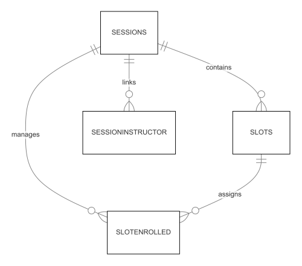
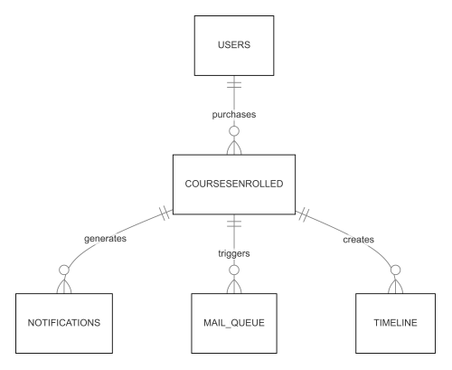
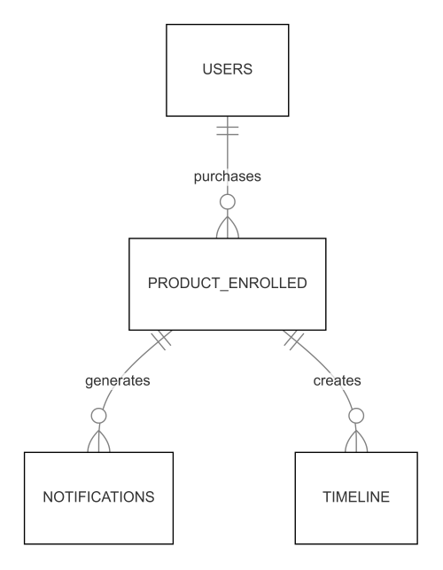

# ER Flow Diagram

## Payment Flow 

- **USERS** initiate payments
- **PAYMENTS** are recorded and if status = `COMPLETED` then it linked to **STUDENT_PAYMENTS**
- **PAYMENTS** generate corresponding **INVOICES**
- If **PAYMENTS** Method is payfast then it will stores in a **PAYFAST_TRANSACTION**

(**Note** : If Payment is not completed (Started or Failed) then it will stores in payments table)

### Relationships:

1. A Student can make multiple payments
2. Each payment can create a student payment record
3. Each payment can generate an invoice

-----------------------------------------------------------

## Session/Slot Flow 

- **SESSIONS** can have multiple **SLOTS**
- **SESSIONS** manage multiple **SLOTENROLLED** entries
- **SESSIONS** link to multiple SESSIONINSTRUCTOR records
- **SLOTS** can have multiple **SLOTENROLLED** entries

### Relationships:

1. A single session can have multiple slots
2. Each slot can be enrolled by multiple students through slot enrolled
3. Each session can be linked to multiple instructors via session instructor
4. The ***SESSION ID*** serves as the primary linking identifier across these tables

-----------------------------------------------------

## Course Purchase Flow 

Course Purchase Flow Explanation:
- **USERS** purchase courses, which creates **COURSESENROLLED** records
- Each **COURSESENROLLED** entry:
  1. Generates **NOTIFICATIONS** to Super Admin panel 
  2. Triggers entries in **MAILQUEUE**
  3. Creates a **TIMELINE** record for student activity

### Relationships:

- When a Student purchases a course:
   - A record is created in course enrolled
   - Automatically generates a notification
   - Adds an entry to the mail queue for sending confirmation email
   - Creates a timeline entry for student activity

--------------------------------------------------------
## Product Purchase Flow

- A single **USER** can purchase multiple **PRODUCTS**(one-to-many relationship)
- Each **PRODUCT_ENROLLED** entry can generate multiple **NOTIFICATIONS**
- Each **PRODUCT_ENROLLED** entry can create multiple **TIMELINE** entries

### Relationships:

- When a Student purchases a Product:
   - A record is created in product enrolled
   - Automatically generates a notification
   - Creates a timeline entry for student activity

