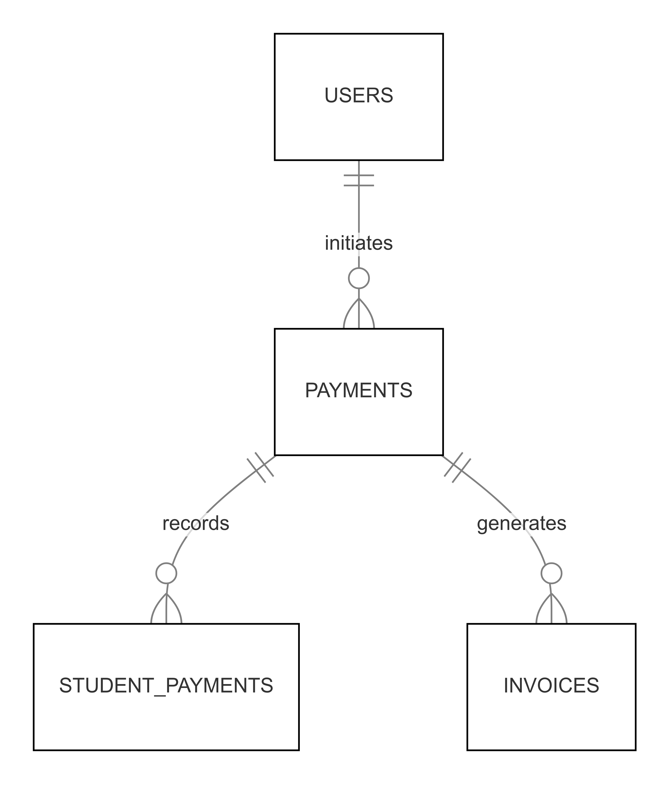

# ER Flow Diagram

## Payment Flow Diagram

### Payment Flow Explanation:
- **USERS** initiate payments
- **PAYMENTS** are recorded and linked to **STUDENTPAYMENTS**
- **PAYMENTS** generate corresponding **INVOICES**

The diagram shows the key relationships in the purchase process:
1. A user can make multiple payments
2. Each payment can create a student payment record
3. Each payment can generate an invoice

